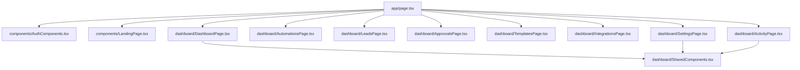

# ACE — Architecture Audit Report

This report evaluates code complexity, dependency mapping, and modularity status for the ACE application core.

---

## 1. File Size Audit

* **[page.tsx](file:///f:/flowpilot-ai/apps/web/src/app/page.tsx)**:
  - **Previous State**: Exceeded **513 lines** containing layout wrappers, sub-tab panels, quick action widgets, and complex form submission logic.
  - **Status**: Successfully decomposed. Reduced to **268 lines** by moving tab rendering systems to `/app/dashboard/` namespace.
* **[LandingPage.tsx](file:///f:/flowpilot-ai/apps/web/src/components/LandingPage.tsx)**:
  - **Status**: Clean composition orchestration module under **26 lines**. All sub-sections modularized.

---

## 2. Coupled Modules & Dependency mapping

---

## 3. Opportunities for Continued Refactoring

* **Auth Context Provider Pattern**:
  - Currently, login state triggers are maintained inside `page.tsx` top-level React states.
  - *Recommendation*: Wrap the application in a custom context provider to share session token and business metadata down the hook chain.
* **Forms Processing Hooks**:
  - Lead captures and onboarding details submission logic can be decoupled from UI files using React Hook Form or custom `useLeadSubmission` hooks.
