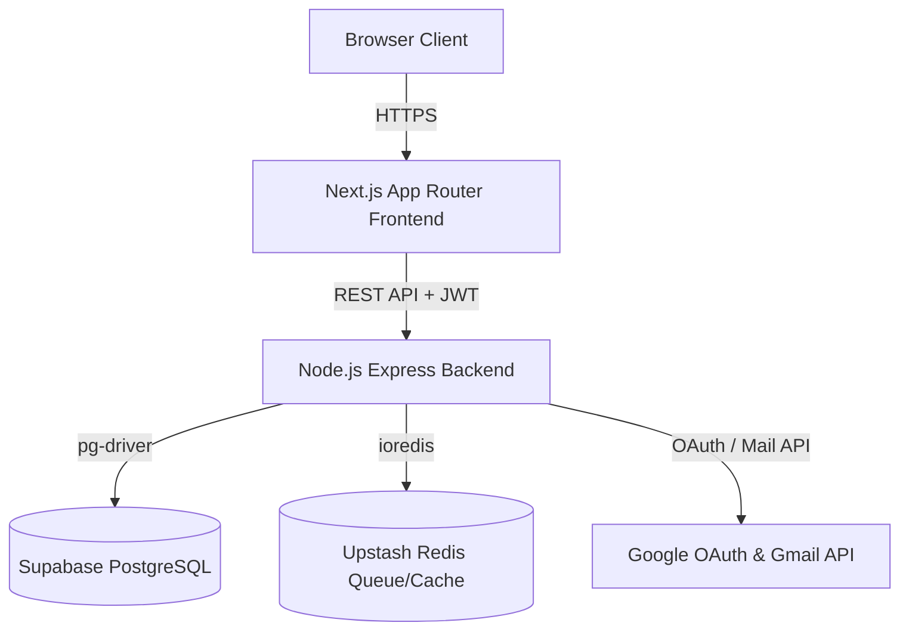

# FlowPilot AI — Architecture Audit

This document describes the system architecture, code modules, endpoints, schemas, and flows of the FlowPilot AI product.

---

## 1. System Components

---

## 2. Frontend Structure

* **Pages**:
  - `/` (Dynamic): Unauthenticated visitors see the `LandingPage`. Authenticated users see the `DashboardLayout`.
  - `/login`: Dedicated login page.
  - `/signup`: Dedicated signup page.
  - `/privacy`: Static public Privacy Policy page.
  - `/terms`: Static public Terms of Service page.
* **Layouts**:
  - `/layout.tsx`: Root HTML shell loading global styles and Tailwind.
* **Shared Components**:
  - `/components/AuthComponents.tsx`: Extracted shared UI elements (`Brand`, `Field`, `Select`, `Badge`, `Banner`, `Empty`, `AuthScreen`, `BusinessSetup`).
  - `/components/LandingPage.tsx`: Marketing layout and security features display.

---

## 3. Backend Structure

* **API Endpoints (`backend/src/routes/index.js`)**:
  - `POST /api/auth/signup`
  - `POST /api/auth/login`
  - `GET /api/auth/google` (Redirects to Google OAuth page)
  - `GET /api/auth/google/callback` (Code exchange and JWT redirection)
  - `POST /api/auth/request-password-reset`
  - `POST /api/auth/reset-password`
  - `POST /api/auth/verify-email`
  - `POST /api/sandbox/start`
  - `GET /api/dashboard`
  - `GET /api/workflows`
  - `POST /api/workflows/from-template`
  - `PATCH /api/workflows/:id`
  - `GET /api/leads`
  - `POST /api/leads` (Test lead capture)
  - `GET /api/approvals`
  - `POST /api/approvals/:id/resolve` (Approve/Reject follow-up draft)
  - `GET /api/integrations`
  - `POST /api/integrations/gmail/sync` (Trigger inbox sync)
  - `GET /api/activity`
  - `GET /api/templates`
  - `GET /api/system/status`
* **Services**:
  - `auth.service.js`: User lifecycle, tokens, and password reset workflows.
  - `oauth.service.js`: Google client configs, URI builder, state validation, and token exchanges.
  - `user.service.js`: Dashboard metrics calculation and profile sync.
  - `email.service.js`: System and notification mail delivery.
* **Repository Layer (`backend/repository.js`)**:
  - Manages database transaction queries mapping to the tables.
* **Queues**:
  - BullMQ (Upstash Redis) handles asynchronous lead processing, AI drafting, and email retry pipelines.

---

## 4. Database Table Inventory

| Table | Primary Key | Foreign Keys | Unique Constraints | Indexes |
|---|---|---|---|---|
| **users** | `id` | None | `email` | `users_email_idx` |
| **businesses** | `id` | `user_id` -> `users.id` | `user_id` | `businesses_user_id_idx` |
| **integrations** | `id` | `user_id` -> `users.id` | `(user_id, provider)` | `integrations_user_id_provider_idx` |
| **workflow_templates** | `id` | None | None | None |
| **workflows** | `id` | `user_id` -> `users.id` `template_id` -> `workflow_templates.id` | None | `workflows_user_id_idx` |
| **leads** | `id` | `user_id` -> `users.id` | `gmail_message_id` | `leads_user_id_idx` |
| **approvals** | `id` | `user_id` -> `users.id` `lead_id` -> `leads.id` | `lead_id` | `approvals_user_id_idx` |
| **activity_logs** | `id` | `user_id` -> `users.id` | None | `activity_logs_user_id_idx` |
| **processed_webhook_events**| `value` | None | None | None |
| **auth_tokens** | `id` | `user_id` -> `users.id` | None | `auth_tokens_token_hash_idx` |
| **outbox** | `id` | `user_id` -> `users.id` | None | `outbox_user_id_idx` |

---

## 5. Technical Debt & Risks

* **Dead Code**: Replaced local page layouts in `apps/web/src/app/page.tsx` are now fully extracted.
* **Oversized Files**: `backend/repository.js` exceeds 1000 lines because all database operations are bundled in a single file. (Recommended to split into table-specific repository files).
* **Duplicated Code**: OAuth code exchanges and token mapping contain separate logic paths for integrations vs login. (Unified in `oauth.service.js`).
* **Technical Debt**: BullMQ has fallback mocks for local test running, but should be separated from server execution contexts.
