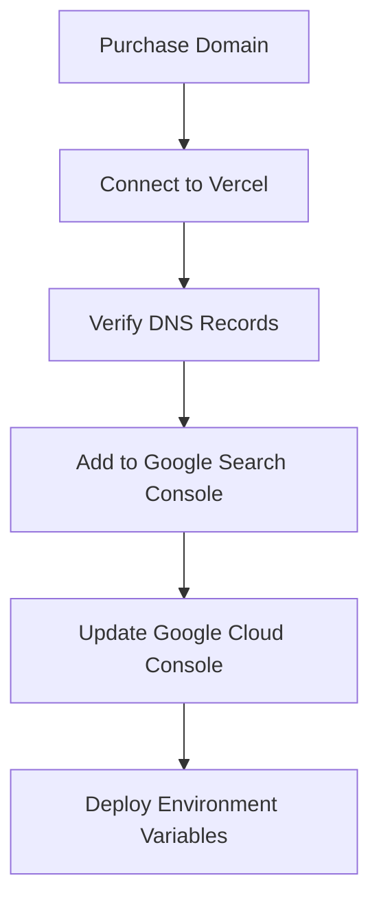

# FlowPilot AI — Custom Domain Plan & Google Search Console Verification

To complete Google OAuth compliance and brand checks, you must migrate from a shared `vercel.app` domain to a dedicated custom domain (e.g. `flowpilotai.com` or `flowpilot.app`). Google prohibits OAuth verification for shared wildcard subdomains like Vercel because domain ownership cannot be validated through Search Console at the root level.

---

## 1. Recommended Domain Names

We recommend acquiring one of the following available domain options:
* **`flowpilotai.com`** (Recommended - matches product name and adds industry classification)
* **`flowpilot.app`** (Highly relevant for software tools)
* **`getflowpilot.com`**
* **`flowpilothq.com`**

---

## 2. Step-by-Step Migration and Verification Process

### Step 1: Purchase the Domain
Buy your target domain (`flowpilotai.com`) from a domain registrar of your choice (e.g., Namecheap, Google Domains, Cloudflare).

### Step 2: Configure Vercel Hosting Mappings
1. Open the [Vercel Dashboard](https://vercel.com).
2. Go to **Project Settings** &rarr; **Domains**.
3. Add `flowpilotai.com` and `www.flowpilotai.com` (recommend configuring `www` to redirect to the apex domain).

### Step 3: Configure DNS Records
Configure the following DNS settings at your domain registrar's panel:
* **A Record** (apex domain): `76.76.21.21` (Vercel IP address)
* **CNAME Record** (`www` subdomain): `cname.vercel-dns.com`

Once DNS propagates (usually within 10-15 minutes), Vercel will automatically provision SSL certificates.

### Step 4: Verify Domain Ownership in Google Search Console
To register the domain under your OAuth Consent Screen, you must verify ownership:
1. Navigate to [Google Search Console](https://search.google.com/search-console).
2. Click **Add Property** and select **Domain**.
3. Input your domain: `flowpilotai.com`.
4. Copy the generated **TXT record** (e.g., `google-site-verification=...`).
5. Add this TXT record to your DNS configuration at your registrar.
6. Click **Verify** in Search Console.

### Step 5: Update Google Cloud Console Credentials
Once verified, update your Google credentials:
1. Navigate to the [Google Cloud Console Credentials Screen](https://console.cloud.google.com/apis/credentials).
2. Open your OAuth client.
3. Add the apex domain to **Authorized domains**:
   - `flowpilotai.com`
4. Update the **Authorized redirect URIs**:
   - Add: `https://flowpilotai.com/api/auth/google/callback`

### Step 6: Deploy New Env Redirect Configurations
Update the environment variables on Render (or whichever host is running your Express backend API):
* **`GOOGLE_CALLBACK_URL`**: `https://flowpilot-api-pyp5.onrender.com/api/auth/google/callback` (or your backend domain redirect callback)
* Ensure both backend client calls redirect to the verified callback URI exactly.
