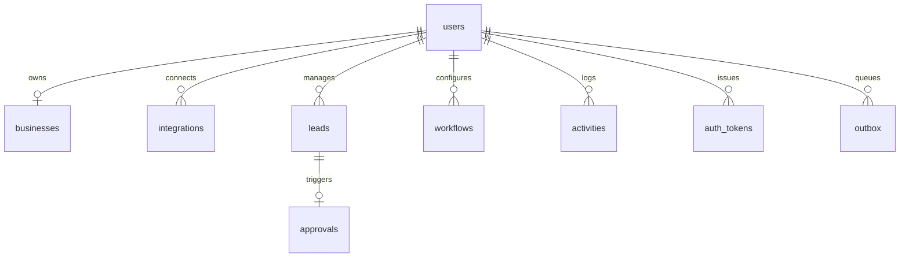

# Database Migration & Normalization Plan

This document outlines the migration plan to transition FlowPilot AI's database layer from an in-memory document-store snapshot wrapper to a normalized, high-performance relational PostgreSQL schema.

---

## 1. Target Relational Schema Design

To maintain strict PostgreSQL standards while preserving JavaScript camelCase properties, column names in SQL will use standard database `snake_case`. The database adapter `repository.js` will automatically convert keys back and forth.



### 1.1 Table: `users`
- `id` VARCHAR(255) PRIMARY KEY (prefix `usr_`)
- `name` VARCHAR(255) NOT NULL
- `email` VARCHAR(255) UNIQUE NOT NULL (lowercased)
- `password_hash` VARCHAR(255) (null for Google Logins)
- `email_verified` BOOLEAN DEFAULT FALSE
- `google_id` VARCHAR(255)
- `plan` VARCHAR(50) DEFAULT 'free'
- `billing` JSONB (subscription details)
- `created_at` TIMESTAMPTZ NOT NULL DEFAULT NOW()
- `email_verified_at` TIMESTAMPTZ
- `password_changed_at` TIMESTAMPTZ

### 1.2 Table: `businesses`
- `id` VARCHAR(255) PRIMARY KEY (prefix `biz_`)
- `user_id` VARCHAR(255) UNIQUE NOT NULL REFERENCES users(id) ON DELETE CASCADE
- `name` VARCHAR(255) NOT NULL
- `type` VARCHAR(100) DEFAULT 'other'
- `tone` VARCHAR(100) DEFAULT 'professional'
- `goals` TEXT[] DEFAULT ARRAY['lead_follow_up']
- `created_at` TIMESTAMPTZ NOT NULL DEFAULT NOW()
- `updated_at` TIMESTAMPTZ NOT NULL DEFAULT NOW()

### 1.3 Table: `integrations`
- `id` VARCHAR(255) PRIMARY KEY (prefix `int_`)
- `user_id` VARCHAR(255) NOT NULL REFERENCES users(id) ON DELETE CASCADE
- `provider` VARCHAR(100) NOT NULL
- `status` VARCHAR(50) DEFAULT 'connected'
- `encrypted_credentials` TEXT
- `connected_email` VARCHAR(255)
- `created_at` TIMESTAMPTZ NOT NULL DEFAULT NOW()
- `updated_at` TIMESTAMPTZ NOT NULL DEFAULT NOW()
- **Constraint:** UNIQUE(user_id, provider)

### 1.4 Table: `leads`
- `id` VARCHAR(255) PRIMARY KEY (prefix `lead_`)
- `user_id` VARCHAR(255) NOT NULL REFERENCES users(id) ON DELETE CASCADE
- `name` VARCHAR(255) NOT NULL
- `email` VARCHAR(255)
- `phone` VARCHAR(100)
- `message` TEXT DEFAULT ''
- `source` VARCHAR(100) DEFAULT 'manual'
- `status` VARCHAR(50) DEFAULT 'new'
- `created_at` TIMESTAMPTZ NOT NULL DEFAULT NOW()

### 1.5 Table: `approvals`
- `id` VARCHAR(255) PRIMARY KEY (prefix `appr_`)
- `user_id` VARCHAR(255) NOT NULL REFERENCES users(id) ON DELETE CASCADE
- `lead_id` VARCHAR(255) UNIQUE NOT NULL REFERENCES leads(id) ON DELETE CASCADE
- `status` VARCHAR(50) DEFAULT 'pending'
- `kind` VARCHAR(100) NOT NULL DEFAULT 'follow_up_draft'
- `draft` TEXT
- `ai_provider` VARCHAR(100)
- `delivery_provider` VARCHAR(100)
- `created_at` TIMESTAMPTZ NOT NULL DEFAULT NOW()
- `resolved_at` TIMESTAMPTZ

### 1.6 Table: `workflows`
- `id` VARCHAR(255) PRIMARY KEY (prefix `wf_`)
- `user_id` VARCHAR(255) NOT NULL REFERENCES users(id) ON DELETE CASCADE
- `template_id` VARCHAR(100)
- `name` VARCHAR(255) NOT NULL
- `status` VARCHAR(50) DEFAULT 'active'
- `trigger_key` VARCHAR(100) NOT NULL
- `actions` JSONB DEFAULT '[]'::jsonb
- `runs` INTEGER DEFAULT 0
- `created_at` TIMESTAMPTZ NOT NULL DEFAULT NOW()
- `updated_at` TIMESTAMPTZ NOT NULL DEFAULT NOW()

### 1.7 Table: `activities`
- `id` VARCHAR(255) PRIMARY KEY (prefix `act_`)
- `user_id` VARCHAR(255) NOT NULL REFERENCES users(id) ON DELETE CASCADE
- `type` VARCHAR(100) NOT NULL
- `label` VARCHAR(255) NOT NULL
- `source` VARCHAR(100) DEFAULT 'system'
- `status` VARCHAR(50) DEFAULT 'success'
- `created_at` TIMESTAMPTZ NOT NULL DEFAULT NOW()

### 1.8 Table: `auth_tokens`
- `id` VARCHAR(255) PRIMARY KEY (prefix `tok_`)
- `user_id` VARCHAR(255) NOT NULL REFERENCES users(id) ON DELETE CASCADE
- `kind` VARCHAR(100) NOT NULL
- `token_hash` VARCHAR(255) NOT NULL
- `expires_at` TIMESTAMPTZ NOT NULL
- `created_at` TIMESTAMPTZ NOT NULL DEFAULT NOW()
- `used_at` TIMESTAMPTZ

### 1.9 Table: `outbox`
- `id` VARCHAR(255) PRIMARY KEY (prefix `mail_`)
- `user_id` VARCHAR(255) NOT NULL REFERENCES users(id) ON DELETE CASCADE
- `to_email` VARCHAR(255) NOT NULL
- `kind` VARCHAR(100) NOT NULL
- `status` VARCHAR(50) DEFAULT 'queued'
- `link` TEXT
- `created_at` TIMESTAMPTZ NOT NULL DEFAULT NOW()
- `sent_at` TIMESTAMPTZ

---

## 2. API & Frontend Compatibility Strategy

To avoid modifying any frontend component pages or breaking backend controller signatures:

1. **Mapping Layer in Repository:**
   `repository.js` will export utility mapper helper objects:
   ```javascript
   function toCamel(row) {
     if (!row) return null;
     const camel = {};
     for (const key of Object.keys(row)) {
       const camelKey = key.replace(/_([a-z])/g, (g) => g[1].toUpperCase());
       camel[camelKey] = row[key];
     }
     return camel;
   }

   function toSnake(obj) {
     if (!obj) return null;
     const snake = {};
     for (const key of Object.keys(obj)) {
       const snakeKey = key.replace(/([A-Z])/g, (g) => `_${g[0].toLowerCase()}`);
       snake[snakeKey] = obj[key];
     }
     return snake;
   }
   ```
2. **Granular DB Queries:**
   Remove `readStore()` and `writeStore()`. Replace with granular functions exposed by the repository:
   - `repository.users.findByEmail(email)`
   - `repository.leads.insert(lead)`
   - `repository.approvals.updateStatus(approvalId, status, draft)`

---

## 3. Data Migration Sequence

To migrate active staging installations without losing database states:

1. **Deploy Tables:** Apply migrations creating all 9 tables. Keep the legacy `flowpilot_records` table intact.
2. **Execute ETL Migrator:** Run a custom migrator script `backend/migrate-normalized.js` that:
   - Selects all records from `flowpilot_records`.
   - Iterates through rows, converting `data` jsonb properties to snake_case.
   - Inserts records into respective target tables.
3. **Switch Repository Mode:** Toggle a database configuration environment flag `NORMALIZED_DB=true`, forcing the server to load routing requests using the new granular queries rather than the old document snapshots.
4. **Cleanup:** After confirming production safety, run migrations dropping the legacy `flowpilot_records` table.
