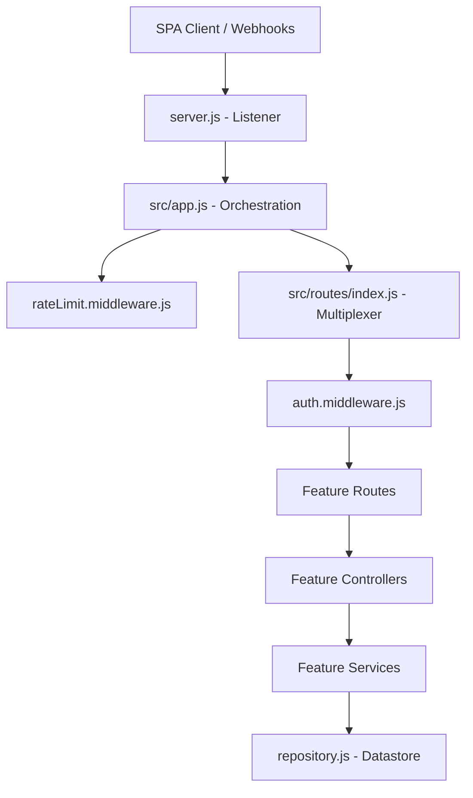
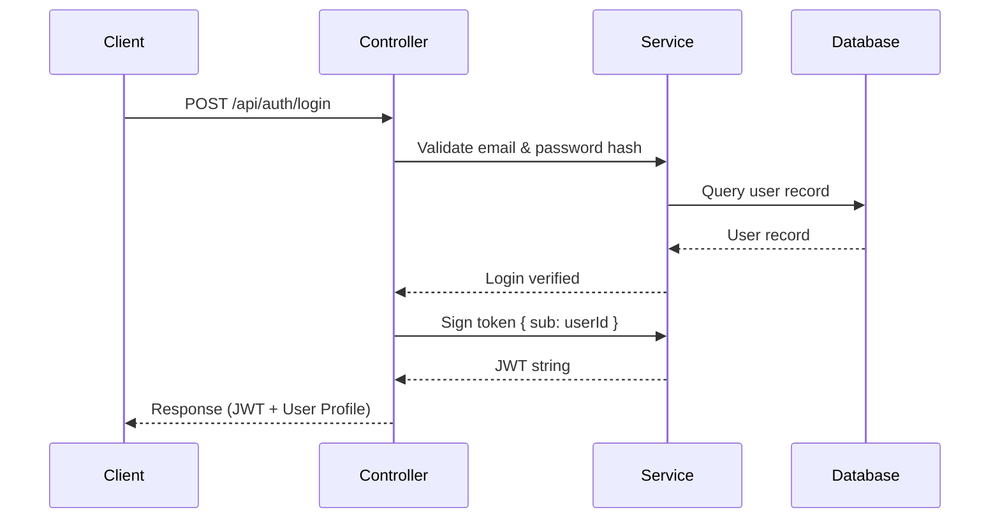
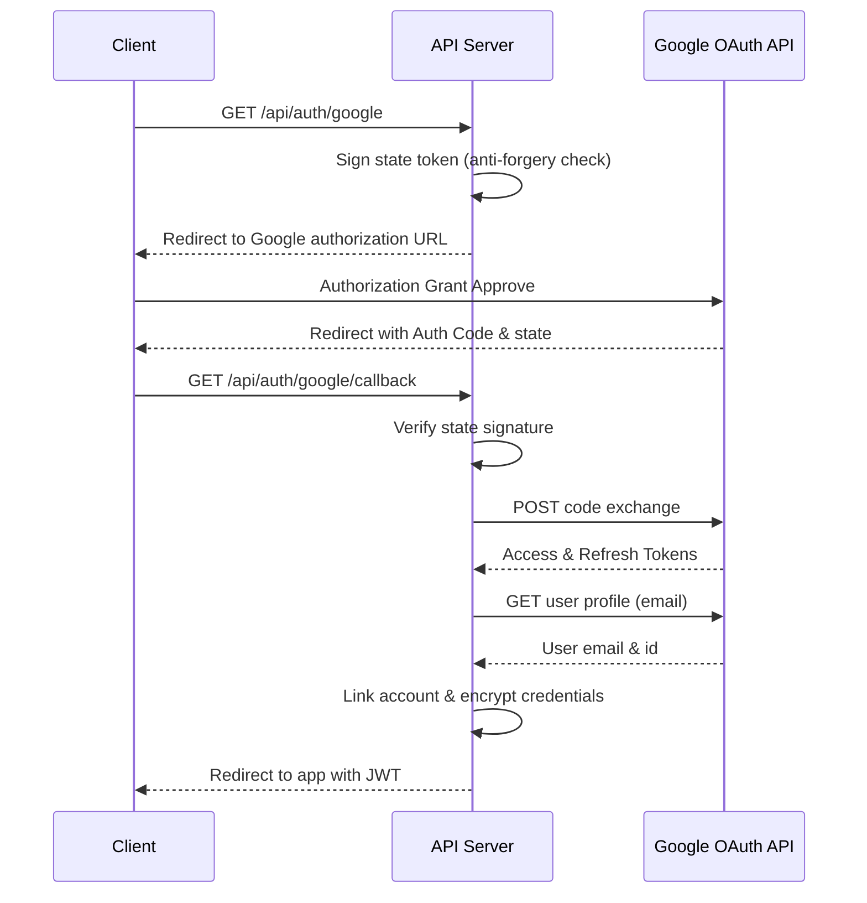
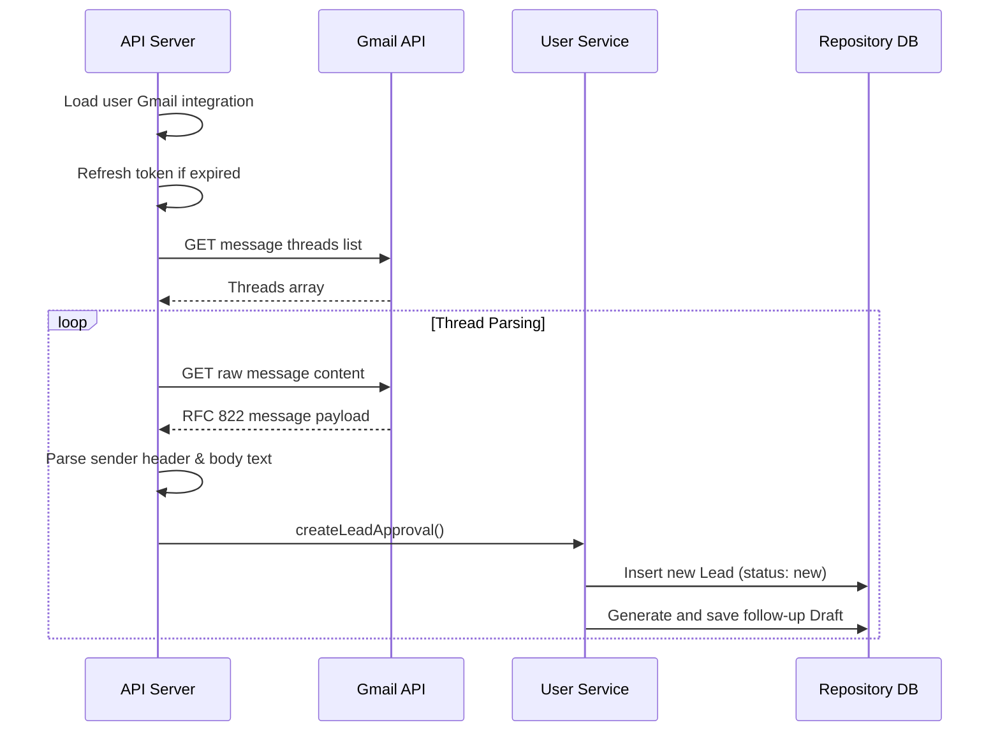
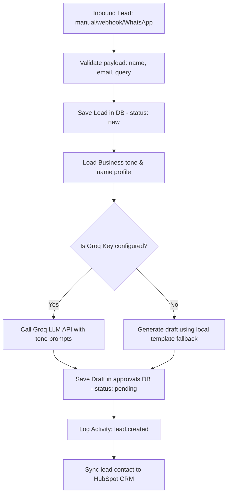
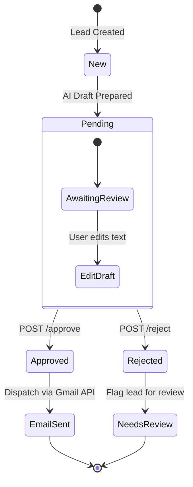

# System Architecture & Design

This document details the backend architectural design of FlowPilot AI, mapping operational flows, request lifecycles, and core business sequences.

---

## 1. High-Level System Architecture

FlowPilot AI splits tasks between request parsing (controllers), business operations (services), and storage synchronization (repositories).

---

## 2. Request Lifecycle

1. **TCP Connection**: Client requests are bound by the HTTP listener in `server.js`.
2. **Context Enrichment**: `src/app.js` tags the connection with a `requestId` and hooks a response listener for structured metrics.
3. **Throttling check**: In-memory rate limiting check.
4. **Multiplexing**: Central route index router delegates routing matches to sub-route handlers.
5. **Guard Verification**: Auth token decryption and validation checks.
6. **Controller Trigger**: Request buffers parsed, parameters validated, controller processes payloads.
7. **Transactional execution**: Business services perform work and commit writes.
8. **Error capture**: Central try-catch captures exceptions, hides debugging stacks in production, and returns uniform JSON error payloads.

---

## 3. Core Business Flows

### 3.1 Authentication Flow
Uses short-lived cryptographically signed JSON Web Tokens (JWT) to secure user requests.

### 3.2 Google OAuth Flow
Links workspaces to Google logins and establishes OAuth email permissions.

### 3.3 Gmail Inbox Lead Synchronization
Background scheduler polls Gmail messages to ingest lead records automatically.

### 3.4 Lead Intake Processing & AI Draft Generation
Handles lead registration and proposed follow-up messages.

### 3.5 Approval Workflow
Ensures human-in-the-loop validation before automated communications are sent.

---

## 4. Integration Architecture

FlowPilot integrates with third-party SaaS services:

1. **Meta WhatsApp Business Webhooks**:
   - Inbound endpoint verified using `WHATSAPP_VERIFY_TOKEN`.
   - Incoming messages trigger HMAC-SHA256 signature checks using `WHATSAPP_APP_SECRET`.
   - Messages are parsed and ingested as leads under the workspace owner account.
2. **HubSpot CRM API**:
   - Outbound contact sync exchanges HubSpot OAuth codes, persists refresh credentials, and pushes contact payloads (email, name, phone) on lead creations.
3. **Razorpay Billing**:
   - Creates active subscription plans via API keys.
   - Receives subscription state triggers (payment success/failures) verified via `RAZORPAY_WEBHOOK_SECRET` signatures.
