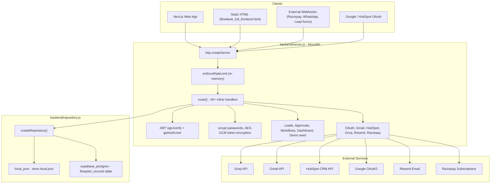
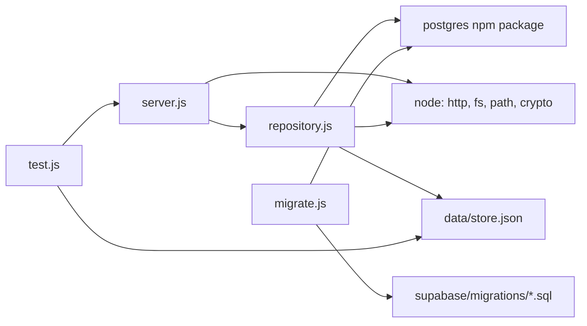

# FlowPilot Backend Audit

**Date:** 2026-07-12  
**Scope:** `backend/` and related persistence (`supabase/`), deployment (`render.yaml`), and API client (`apps/web/src/lib/api.ts`)  
**Constraint:** Read-only analysis — no code changes performed.

---

## Executive Summary

The FlowPilot backend is a **single-file monolith** (`backend/server.js`, ~1,140 lines) built on Node.js native `http` with one external dependency (`postgres`). It implements a full MVP API: auth, OAuth, Gmail/HubSpot integrations, webhooks, AI drafting, billing hooks, and a JSON-document or Postgres-backed data store.

There are **no separate route, controller, service, or middleware modules**. All HTTP handling, business logic, crypto, and third-party calls live inline in `server.js`. Persistence is abstracted in `repository.js` via a document-store pattern (11 collections serialized as JSON blobs).

This audit documents the current state, risks, and a phased migration plan toward a layered, testable architecture without prescribing immediate refactors.

---

## 1. Current Architecture

### 1.1 High-Level Diagram



### 1.2 File Inventory

| File | Role | Lines (approx.) |
|------|------|-----------------|
| `backend/server.js` | HTTP server, routing, all business logic, auth, OAuth, integrations | ~1,140 |
| `backend/repository.js` | Data access: local JSON file or Postgres document store | ~245 |
| `backend/migrate.js` | Applies `supabase/migrations/202606020001_flowpilot_core.sql` | ~25 |
| `backend/test.js` | End-to-end smoke tests (spawns server, hits API) | ~210 |
| `backend/data/store.json` | Seed data (users, templates, empty collections) | — |
| `supabase/migrations/202606020001_flowpilot_core.sql` | Active DB schema (`flowpilot_records`) | ~35 |
| `supabase/schema.sql` | Legacy normalized schema (reference only, not used by server) | ~127 |

**Note:** `README.md` references `backend/postgres.js`, which does not exist. Postgres logic lives inside `repository.js`.

### 1.3 Architectural Pattern

| Layer (conventional) | Current implementation |
|----------------------|------------------------|
| **Routes** | Giant `if/else` chain in `route()` (`server.js:616–1113`) |
| **Controllers** | None — handler logic inline per route |
| **Services** | None — domain functions co-located in `server.js` |
| **Middleware** | Wrapper-level rate limit + inline auth gate; no composable stack |
| **Repository / DB** | `repository.js` with `read()` / `write()` full-store snapshots |
| **Models / DTOs** | Plain JS objects; no validation schema library |

### 1.4 Data Model (Document Store)

All application state is held in a single in-memory object with 11 collections:

```
users, businesses, integrations, templates, workflows, leads,
activity, approvals, processedWebhookEvents, authTokens, outbox
```

**Postgres mode:** Each record is stored as a JSONB row in `public.flowpilot_records` keyed by `(collection, record_id)`. Writes use `TRUNCATE` + full re-insert inside a transaction with advisory lock `721904` — effectively a **whole-store rewrite** on every `writeStore()` call.

**Local JSON mode:** Reads/writes `backend/data/store.local.json` (copied from seed on first run).

### 1.5 Request Lifecycle

1. `http.createServer` assigns `X-Request-Id`, logs on `finish`
2. `enforceRateLimit` — IP-based, in-memory buckets (auth: 12/min, API: 180/min)
3. `route()` loads **entire store** via `readStore()`
4. Path/method matched sequentially
5. Public routes handled first (health, webhooks, auth, OAuth, templates)
6. Auth gate at `server.js:939–941`: Bearer JWT required for remaining `/api/*`
7. Production email-verification gate (except `/api/me`)
8. Handler mutates in-memory store, calls `writeStore()` as needed
9. Uncaught errors → 500 with structured log

### 1.6 Environment & Deployment

- **Runtime:** Node ≥20, single process, no clustering
- **Deploy:** Render (`render.yaml`) with `ALLOW_JSON_STORE_IN_PRODUCTION=true` on free tier
- **Frontend:** Next.js on Vercel calls API via `NEXT_PUBLIC_API_URL`
- **CORS:** Single origin (`APP_ORIGIN`), not wildcard

---

## 2. Dependency Graph

### 2.1 Module Dependencies



### 2.2 Runtime External Dependencies

| Dependency | Used by | Purpose |
|------------|---------|---------|
| `postgres` | `repository.js`, `migrate.js` | Supabase/Postgres connection |
| Groq API | `draftFollowUp()` | AI follow-up drafts |
| Google OAuth2 | Auth + Gmail integration | Login, token exchange, refresh |
| Gmail API | `sendGmailFollowUp`, `syncGmailInbox` | Send email, list/read inbox |
| HubSpot OAuth + CRM API | `syncHubspotLead` | Contact sync |
| Resend API | `deliverAccountEmail` | Verification/reset emails |
| Razorpay API | Subscription creation + webhook | Billing |
| Meta WhatsApp | Webhook verify + inbound messages | Lead intake |

### 2.3 Internal Function Dependency Clusters (within `server.js`)

```text
Crypto & Auth
  hashPassword, verifyPassword, signToken, verifyToken, getAuthUser
  encryptSecret, decryptSecret, tokenHash, issueAccountToken, consumeAccountToken

OAuth & Integrations
  integrationConfig, oauthRedirectUri, oauthAuthorizationUrl
  exchangeOauthCode, getIntegrationAccessToken, upsertIntegration

Gmail
  encodeEmail, sendGmailFollowUp, parseGmailFromHeader
  listGmailInboxMessages, getGmailMessage, syncGmailInbox

Lead Workflow
  draftFollowUp, fallbackDraftFollowUp, createLeadApproval
  syncHubspotLead, logActivity, dashboardFor

Webhooks & Billing
  signaturesMatch, Razorpay handler, WhatsApp handler, lead webhook

Demo / Sandbox
  seedDemoWorkspace
```

Every handler depends on `readStore()` → mutate → `writeStore()`, creating tight coupling and full-store I/O per request.

---

## 3. Route Inventory

### 3.1 Legend

| Auth | Meaning |
|------|---------|
| **None** | Public |
| **Secret** | Shared secret header/signature |
| **OAuth** | Provider redirect flow |
| **Bearer** | `Authorization: Bearer <JWT>` |
| **Bearer+** | Bearer + `emailVerified` required in production |

### 3.2 Infrastructure & Static

| Method | Path | Auth | Handler location | Description |
|--------|------|------|------------------|-------------|
| `OPTIONS` | `*` | None | `server.js:621` | CORS preflight |
| `GET` | `/health` | None | `server.js:622` | Health check |
| `HEAD` | `/` | None | `server.js:625` | Root probe |
| `GET` | `/`, `/flowdesk_full_frontend.html` | None | `server.js:627–629` | Serve legacy static HTML |
| `GET` | `/favicon.ico` | None | `server.js:632` | Empty 204 |
| `GET` | `/api/system/status` | None | `server.js:623` | Service configuration status |

### 3.3 Sandbox / Demo

| Method | Path | Auth | Description |
|--------|------|------|-------------|
| `POST` | `/api/demo/start` | None | Seed demo workspace, return JWT |
| `POST` | `/api/sandbox/start` | None | Alias of demo start |
| `POST` | `/api/demo/reset` | Bearer | Reset demo data (demo user only) |
| `POST` | `/api/sandbox/reset` | Bearer | Reset sandbox (demo user only) |

*Gated by `PUBLIC_SANDBOX_ENABLED` env var.*

### 3.4 Webhooks

| Method | Path | Auth | Description |
|--------|------|------|-------------|
| `POST` | `/api/webhooks/lead/:userId` | `x-flowpilot-webhook-secret` | Create lead + approval for user |
| `GET` | `/api/webhooks/whatsapp` | `hub.verify_token` query param | Meta webhook verification |
| `POST` | `/api/webhooks/whatsapp` | `x-hub-signature-256` HMAC | Inbound WhatsApp messages → leads |
| `POST` | `/api/webhooks/razorpay` | `x-razorpay-signature` HMAC | Subscription status → user plan |

### 3.5 Authentication (Email/Password)

| Method | Path | Auth | Rate limited | Description |
|--------|------|------|--------------|-------------|
| `POST` | `/api/auth/signup` | None | Yes (auth) | Register; queues verification email |
| `POST` | `/api/auth/login` | None | Yes (auth) | Email/password login |
| `POST` | `/api/auth/request-email-verification` | None | No* | Resend verification |
| `POST` | `/api/auth/verify-email` | None | Yes (auth) | Consume verification token |
| `POST` | `/api/auth/request-password-reset` | None | Yes (auth) | Queue reset email |
| `POST` | `/api/auth/reset-password` | None | Yes (auth) | Set new password |

\*Only paths matching the auth rate-limit regex are limited; `request-email-verification` is **not** in that list.

### 3.6 Google OAuth (Login + Gmail)

| Method | Path | Auth | Description |
|--------|------|------|-------------|
| `GET` | `/api/auth/google` | None | Redirect to Google consent (profile, email, gmail scopes) |
| `GET` | `/api/auth/google/callback` | OAuth state JWT | Exchange code, upsert user + Gmail integration, redirect with `google_token` |

### 3.7 Integration OAuth (Connect while logged in)

| Method | Path | Auth | Description |
|--------|------|------|-------------|
| `GET` | `/api/oauth/gmail/callback` | OAuth state JWT | Gmail connect callback |
| `GET` | `/api/oauth/hubspot/callback` | OAuth state JWT | HubSpot connect callback |
| `POST` | `/api/integrations/:provider/connect` | Bearer+ | Start OAuth or demo-mode connect |
| `POST` | `/api/integrations/gmail/sync` | Bearer+ | Pull inbox messages → leads (max 10) |

### 3.8 Workspace API (Authenticated)

| Method | Path | Auth | Description |
|--------|------|------|-------------|
| `GET` | `/api/me` | Bearer | Current user + business (exempt from email-verify gate) |
| `POST` | `/api/onboarding/business` | Bearer+ | Create/update business profile |
| `GET` | `/api/dashboard` | Bearer+ | Metrics, workflows, activity, approvals |
| `GET` | `/api/workflows` | Bearer+ | List user workflows |
| `POST` | `/api/workflows/from-template` | Bearer+ | Activate template |
| `PATCH` | `/api/workflows/:id` | Bearer+ | Pause/resume workflow |
| `GET` | `/api/leads` | Bearer+ | List leads |
| `POST` | `/api/leads` | Bearer+ | Create lead + approval + HubSpot sync |
| `GET` | `/api/approvals` | Bearer+ | List approvals with lead embed |
| `POST` | `/api/approvals/:id/approve` | Bearer+ | Approve draft, optionally send Gmail |
| `POST` | `/api/approvals/:id/reject` | Bearer+ | Reject draft |
| `GET` | `/api/activity` | Bearer+ | Activity log |
| `GET` | `/api/integrations` | Bearer+ | List integrations |
| `POST` | `/api/ai/draft-follow-up` | Bearer+ | Generate AI draft |
| `POST` | `/api/billing/subscription` | Bearer+ | Create Razorpay subscription |

### 3.9 Public but Unauthenticated API

| Method | Path | Auth | Description |
|--------|------|------|-------------|
| `GET` | `/api/templates?q=` | **None** | Search workflow templates (no auth required) |

### 3.10 Documented but Missing / Stale

| Documented | Status |
|------------|--------|
| `POST /api/webhooks/lead` (README) | Actual path is `/api/webhooks/lead/:userId` |
| `POST /api/billing/portal` (backend README) | **Not implemented** — only `/api/billing/subscription` exists |
| `backend/postgres.js` (root README) | **Does not exist** |

---

## 4. Component Deep Dive

### 4.1 Middleware (De Facto)

| Concern | Implementation | Location |
|---------|----------------|----------|
| Rate limiting | In-memory `Map`, per-IP | `enforceRateLimit()` `server.js:53–68` |
| Request ID | `x-request-id` header or generated | `server.js:1117` |
| Structured logging | JSON logs on request finish / errors | `structuredLog()` `server.js:32–34` |
| Body size limit | 1 MB default (`MAX_BODY_BYTES`) | `readRawBody()` `server.js:134–149` |
| CORS | Single `APP_ORIGIN` | `send()` `server.js:118–120` |
| Security headers | CSP, COOP, X-Frame-Options, etc. | `send()` `server.js:123–128` |
| Auth middleware | Inline JWT lookup | `getAuthUser()` + gate `server.js:939` |
| Email verification | Production-only inline check | `server.js:941` |
| Error handler | `.catch()` on `route()` | `server.js:1121–1124` |
| Env validation | Throws in production on misconfig | `validateEnvironment()` `server.js:36–47` |

**No composable middleware pipeline** — concerns are scattered between server wrapper and `route()`.

### 4.2 JWT Logic

| Function | Purpose |
|----------|---------|
| `signToken(payload)` | HS256 HMAC JWT, 7-day expiry, merges `exp` |
| `verifyToken(token)` | Signature verify (timing-safe), expiry check |
| `getAuthUser(req, store)` | Extract Bearer token → `payload.sub` → user lookup |

**Also used for OAuth state:** `signToken({ sub: userId, provider })` — same secret and algorithm as session tokens.

**Characteristics:**
- Custom implementation (no `jsonwebtoken` library)
- Symmetric HS256 only
- No `iat`, `jti`, or refresh tokens
- No token revocation list
- 7-day fixed TTL for all token types

### 4.3 OAuth Logic

**Two distinct OAuth flows:**

1. **Google Login** (`/api/auth/google`, `/api/auth/google/callback`)
   - Scopes: `userinfo.profile`, `userinfo.email`, `gmail.send`, `gmail.readonly`
   - Creates/links user by email, stores Gmail tokens, issues FlowPilot JWT via redirect query param

2. **Integration Connect** (`POST /api/integrations/:provider/connect` → `/api/oauth/:provider/callback`)
   - Providers: `gmail`, `hubspot`
   - State JWT binds `sub` (user id) + `provider`
   - Tokens encrypted with AES-256-GCM before storage

**Token refresh:** `getIntegrationAccessToken()` refreshes OAuth tokens when within 60s of expiry and persists updated credentials back to store.

**Demo fallback:** If OAuth credentials missing, `connect` marks integration `connected` without real tokens (`mode: "demo"`).

### 4.4 Gmail Integration Logic

| Function | Responsibility |
|----------|----------------|
| `oauthAuthorizationUrl("gmail")` | Build Google consent URL |
| `exchangeOauthCode("gmail", code)` | Authorization code → tokens |
| `getIntegrationAccessToken(integration)` | Decrypt, refresh if needed |
| `encodeEmail({to, subject, body})` | RFC 2822 base64url for Gmail `raw` send |
| `sendGmailFollowUp()` | Send on approval; simulates if disabled/demo/no integration |
| `listGmailInboxMessages()` | Query inbox (7d, exclude promotions/social) |
| `getGmailMessage()` | Fetch metadata (From, Subject, snippet) |
| `syncGmailInbox()` | Create leads from uncaptured messages (max 10) |
| `parseGmailFromHeader()` | Parse `Name <email>` format |

**Send gating:** `DISABLE_REAL_EMAIL_SEND`, demo user `usr_demo_founder`, or missing integration → `provider: "simulation"`.

### 4.5 Database Logic

**`repository.js`:**

| Mode | Trigger | Read | Write |
|------|---------|------|-------|
| `local_json` | No `DATABASE_URL` | Parse JSON file | Write full JSON file |
| `supabase_postgres` | `DATABASE_URL` set | SELECT all rows → rebuild collections | TRUNCATE + INSERT all records in transaction |

**Migration:** `migrate.js` runs SQL file creating `flowpilot_records` with RLS enabled (server-role access expected).

**Legacy schema:** `supabase/schema.sql` defines normalized tables with Supabase Auth `owner_id` FKs and RLS policies — **not wired to the running server**.

### 4.6 Controllers & Services

**Neither exists as separate modules.** The following logical "services" are embedded in `server.js`:

| Logical service | Key functions |
|-----------------|---------------|
| AuthService | signup/login, password hash, account tokens, email queue |
| UserService | `publicUser`, email verification gate |
| BusinessService | `getUserBusiness`, onboarding |
| LeadService | `createLeadApproval`, webhook intake |
| ApprovalService | approve/reject, draft editing |
| WorkflowService | from-template, PATCH status |
| IntegrationService | OAuth, connect, sync |
| GmailService | send, inbox sync |
| HubSpotService | contact sync |
| AIService | `draftFollowUp` (Groq + fallback) |
| BillingService | Razorpay subscription + webhook |
| EmailService | Resend delivery, outbox queue |
| DashboardService | `dashboardFor` aggregation |
| DemoService | `seedDemoWorkspace` |

---

## 5. Security Concerns

### 5.1 Critical / High

| ID | Concern | Details | Recommendation |
|----|---------|---------|----------------|
| S1 | **JWT in URL query string** | Google callback redirects to `?google_token=...` (`server.js:774`) | Use short-lived exchange code + POST, or fragment hash; avoid logging referrer leaks |
| S2 | **Development tokens in API responses** | `developmentToken()` leaks verify/reset tokens in non-production responses (`server.js:270–272`) | Ensure `NODE_ENV=production` everywhere; add explicit guard tests |
| S3 | **Whole-store write race conditions** | Postgres write truncates and re-inserts entire DB per request | Per-record upserts or row-level transactions; optimistic locking |
| S4 | **In-memory rate limiting** | `rateLimitBuckets` Map — ineffective multi-instance, resets on restart | Redis or edge rate limiting (Render/Vercel) |
| S5 | **OAuth state = session JWT** | Same secret/signing for session and OAuth state; no nonce store | Dedicated state parameter with one-time storage |
| S6 | **Public template endpoint** | `GET /api/templates` requires no auth | Low risk (read-only templates) but inconsistent API surface |
| S7 | **Sandbox in production** | `render.yaml` enables `PUBLIC_SANDBOX_ENABLED` and `ALLOW_JSON_STORE_IN_PRODUCTION` | Disable sandbox; require `DATABASE_URL` in production |
| S8 | **Seed store may contain real credentials** | `store.json` includes scrypt password hash for `rajtiwari@gmail.com` | Never ship real user data in seed; rotate if ever deployed |

### 5.2 Medium

| ID | Concern | Details |
|----|---------|---------|
| S9 | No CSRF protection on cookie-less API | Mitigated by Bearer tokens + CORS single origin; still vulnerable if tokens stored in localStorage and XSS exists |
| S10 | `request-email-verification` not rate-limited | Can be abused for email enumeration / Resend cost |
| S11 | Google OAuth requests Gmail scopes at login | Over-permissioning at signup; prefer incremental consent |
| S12 | No refresh token rotation for FlowPilot JWT | 7-day tokens without revocation |
| S13 | `encryptSecret` falls back to `JWT_SECRET` | Single key compromise exposes sessions + OAuth tokens |
| S14 | Webhook replay (Razorpay) | Event ID dedup stored in same mutable store; race under concurrent requests |
| S15 | Lead webhook uses user ID in URL | Predictable if user IDs leak; secret header is primary protection |
| S16 | No input validation library | Email regex only on signup; other fields unchecked |
| S17 | `parseJson` returns `{}` on invalid JSON | Silent empty body may cause logic errors |
| S18 | Demo password hardcoded | `flowpilot-demo` for `usr_demo_founder` in `seedDemoWorkspace` |

### 5.3 Low / Informational

| ID | Concern | Details |
|----|---------|---------|
| S19 | Custom JWT implementation | Correct timing-safe compare, but maintenance burden vs battle-tested library |
| S20 | RLS on `flowpilot_records` | Enabled but server likely uses service role bypassing RLS — document DB role expectations |
| S21 | Static HTML served from API | `flowdesk_full_frontend.html` couples frontend delivery to API |
| S22 | CORS allows only one origin | Correct for prod; dev needs `APP_ORIGIN` alignment |
| S23 | Activity log unbounded growth | No retention/TTL on `activity` collection |

### 5.4 Positive Security Controls

- `scrypt` password hashing with per-user salt
- `crypto.timingSafeEqual` for passwords, JWT signatures, webhook HMACs
- AES-256-GCM for OAuth token storage
- Account tokens stored as SHA-256 hashes (not plaintext)
- Production env validation fails fast on weak secrets
- Body size limits (413 responses tested)
- Security headers on all JSON responses
- Email verification enforced in production before workspace use
- Structured logging with request IDs

---

## 6. Refactoring Opportunities

### 6.1 Structural

1. **Extract router** — Replace 500-line `if` chain with a route table or lightweight router (`find-my-way`, `express.Router`, or native `Map` lookup).
2. **Introduce service layer** — Move domain logic out of `server.js` into `services/*.js` with clear inputs/outputs.
3. **Introduce controllers** — Thin HTTP adapters that parse request, call service, map response.
4. **Composable middleware** — `withAuth`, `withRateLimit`, `withBody`, `withVerifiedEmail` as reusable wrappers.
5. **Split integrations** — `integrations/gmail.js`, `integrations/hubspot.js`, `integrations/oauth.js`.

### 6.2 Data Layer

1. **Replace document store** — Migrate from `flowpilot_records` blob table to normalized schema in `supabase/schema.sql`.
2. **Granular persistence** — Per-entity repositories (`UserRepository`, `LeadRepository`) with upsert/delete instead of full-store rewrite.
3. **Separate templates** — Static seed or DB table read-only; not loaded on every request.
4. **Webhook idempotency table** — Dedicated `webhook_events` with unique constraint (already drafted in legacy schema).

### 6.3 Auth & Security

1. Adopt `jose` or `jsonwebtoken` with explicit claims (`iss`, `aud`, `jti`).
2. Short-lived access + refresh tokens, or migrate to Supabase Auth (keys already in `.env.example`).
3. One-time OAuth state store (Redis/DB).
4. Remove token-from-URL pattern for Google login.
5. Add Zod/io-ts validation for all request bodies.

### 6.4 Operations

1. Add health check for DB connectivity (not just process up).
2. Background job queue for email send, Gmail sync, HubSpot sync (avoid blocking request).
3. Separate API process from static file serving.
4. Expand `test.js` into unit + integration suites per module.

### 6.5 Code Quality

1. `server.js` is untestable in isolation — 0% unit test coverage on pure functions.
2. Duplication between demo/sandbox routes.
3. README/API docs out of sync with implementation.
4. Mixed concerns: HTTP + HTML + crypto + AI in one file.

---

## 7. Proposed Folder Structure

Target layout for a layered Node.js backend (framework-agnostic HTTP or optional Express/Fastify):

```text
backend/
├── src/
│   ├── index.js                    # Process entry: load env, start server
│   ├── app.js                      # HTTP server factory, global middleware chain
│   ├── config/
│   │   ├── env.js                  # Validated env (fail-fast)
│   │   └── constants.js            # Collection names, limits, TTLs
│   ├── middleware/
│   │   ├── rateLimit.js
│   │   ├── requestId.js
│   │   ├── cors.js
│   │   ├── auth.js                 # JWT verify, attach req.user
│   │   ├── requireVerifiedEmail.js
│   │   ├── parseBody.js
│   │   └── errorHandler.js
│   ├── routes/
│   │   ├── index.js                # Mount all route modules
│   │   ├── health.routes.js
│   │   ├── auth.routes.js
│   │   ├── oauth.routes.js
│   │   ├── webhooks.routes.js
│   │   ├── workspace.routes.js     # dashboard, me, onboarding
│   │   ├── leads.routes.js
│   │   ├── approvals.routes.js
│   │   ├── workflows.routes.js
│   │   ├── integrations.routes.js
│   │   ├── billing.routes.js
│   │   ├── ai.routes.js
│   │   └── sandbox.routes.js
│   ├── controllers/
│   │   ├── auth.controller.js
│   │   ├── leads.controller.js
│   │   └── ...                     # Thin: req/res ↔ service calls
│   ├── services/
│   │   ├── auth.service.js
│   │   ├── user.service.js
│   │   ├── business.service.js
│   │   ├── lead.service.js
│   │   ├── approval.service.js
│   │   ├── workflow.service.js
│   │   ├── dashboard.service.js
│   │   ├── email.service.js
│   │   ├── billing.service.js
│   │   ├── ai.service.js
│   │   └── sandbox.service.js
│   ├── integrations/
│   │   ├── oauth/
│   │   │   ├── provider.js         # Shared OAuth helpers
│   │   │   ├── google.js
│   │   │   └── hubspot.js
│   │   ├── gmail/
│   │   │   ├── client.js             # API calls
│   │   │   ├── sync.js
│   │   │   └── send.js
│   │   └── hubspot/
│   │       └── contacts.js
│   ├── lib/
│   │   ├── crypto.js               # scrypt, AES-GCM, HMAC
│   │   ├── jwt.js
│   │   ├── ids.js
│   │   ├── http.js                 # send(), redirect()
│   │   └── logger.js
│   └── db/
│       ├── repository.js             # Interface / factory
│       ├── local-json.repository.js
│       ├── postgres-document.repository.js  # Transitional
│       └── postgres/                 # Normalized repos (target)
│           ├── users.repository.js
│           ├── leads.repository.js
│           └── ...
├── data/
│   └── store.json                    # Seed only (sanitized)
├── migrations/
│   └── ...                           # Symlink or copy from supabase/migrations
├── tests/
│   ├── unit/
│   ├── integration/
│   └── smoke.test.js                 # Current test.js evolved
├── migrate.js
└── package.json                      # Optional backend-scoped deps
```

---

## 8. Step-by-Step Migration Plan

Phased approach designed to keep the API running and tests green after each phase. **Do not skip phases without compatibility shims.**

### Phase 0 — Baseline & Safety (1–2 days)

| Step | Action | Exit criteria |
|------|--------|---------------|
| 0.1 | Run `npm test` and record passing smoke tests | Green baseline |
| 0.2 | Sanitize `backend/data/store.json` (remove real emails/passwords) | Seed is demo-safe |
| 0.3 | Align README route list with actual routes | Docs match code |
| 0.4 | Add `docs/backend-audit.md` to repo (this file) | Audit published |
| 0.5 | Pin production env requirements in Render: `DATABASE_URL`, disable JSON store | Prod uses Postgres |

### Phase 1 — Extract Pure Utilities (2–3 days)

| Step | Action | Exit criteria |
|------|--------|---------------|
| 1.1 | Create `backend/src/lib/` — move `crypto`, `jwt`, `ids`, `logger`, `http` helpers | `server.js` imports from lib |
| 1.2 | Add unit tests for `signToken`/`verifyToken`, `hashPassword`, `encryptSecret` | Tests pass |
| 1.3 | Move `validateEnvironment` to `config/env.js` | Startup unchanged |
| 1.4 | Keep `server.js` as entry point (re-export) | `npm start` works |

**Risk:** Low — pure function extraction.

### Phase 2 — Middleware Extraction (2–3 days)

| Step | Action | Exit criteria |
|------|--------|---------------|
| 2.1 | Extract `rateLimit`, `requestId`, body parser, error handler | Wrapper slimmed |
| 2.2 | Extract `getAuthUser` → `middleware/auth.js` | Auth behavior identical |
| 2.3 | Extract `requireVerifiedEmail` middleware | Prod gate preserved |
| 2.4 | Run smoke tests | All pass |

**Risk:** Low — behavior-preserving wrappers.

### Phase 3 — Service Layer (5–7 days)

| Step | Action | Exit criteria |
|------|--------|---------------|
| 3.1 | Define service interfaces (auth, leads, approvals, integrations) | Typed JSDoc or TS |
| 3.2 | Move `createLeadApproval`, `dashboardFor`, `seedDemoWorkspace` to services | `server.js` delegates |
| 3.3 | Move Gmail/HubSpot/OAuth functions to `integrations/` | Integration tests with mocks |
| 3.4 | Move `draftFollowUp` to `ai.service.js` | Groq fallback works |
| 3.5 | Inject `repository` into services (constructor/factory) | No global store reads in routes |

**Risk:** Medium — ensure `writeStore` call sites remain correct.

### Phase 4 — Router & Controllers (3–5 days)

| Step | Action | Exit criteria |
|------|--------|---------------|
| 4.1 | Build route table: `{ method, path, middleware[], handler }` | All 40+ routes registered |
| 4.2 | Group into route modules under `routes/` | `route()` function deleted |
| 4.3 | Add thin controllers per domain | Controllers < 30 lines each |
| 4.4 | Move static HTML serving behind env flag or remove | API-only deploy option |
| 4.5 | Full smoke test pass | `npm test` green |

**Risk:** Medium — route ordering must preserve auth gate semantics.

### Phase 5 — Repository Granularity (5–10 days)

| Step | Action | Exit criteria |
|------|--------|---------------|
| 5.1 | Add per-collection read/write methods to repository | `getUserById`, `upsertLead`, etc. |
| 5.2 | Replace full-store load in hot paths (auth, single lead) | Measurable fewer DB bytes |
| 5.3 | Change Postgres write from TRUNCATE-all to upsert per record | Concurrent request safety |
| 5.4 | Migration script: `flowpilot_records` → normalized tables | Data preserved |
| 5.5 | Deprecate document repository | Feature flag `USE_NORMALIZED_DB` |

**Risk:** High — data migration; run dual-write period.

### Phase 6 — Auth Hardening (3–5 days)

| Step | Action | Exit criteria |
|------|--------|---------------|
| 6.1 | Replace URL `google_token` with secure exchange endpoint | No tokens in query strings |
| 6.2 | Separate OAuth state signing key + one-time store | State replay prevented |
| 6.3 | Add refresh tokens or evaluate Supabase Auth migration | Session revocation possible |
| 6.4 | Rate-limit `request-email-verification` | Abuse mitigated |
| 6.5 | Security review / pen test on auth flows | Findings addressed |

**Risk:** Medium — frontend must update Google callback handling.

### Phase 7 — Async Jobs & Observability (3–5 days)

| Step | Action | Exit criteria |
|------|--------|---------------|
| 7.1 | Queue outbox emails (in-process → Redis/BullMQ later) | Non-blocking signup |
| 7.2 | Background Gmail sync (optional cron) | Sync endpoint returns job id |
| 7.3 | `/health` checks DB + external config | Render health check upgraded |
| 7.4 | Redis rate limiting for multi-instance | Limits consistent across pods |

**Risk:** Low–medium — new infrastructure (Redis).

### Phase 8 — API Contract & Frontend Alignment (2–3 days)

| Step | Action | Exit criteria |
|------|--------|---------------|
| 8.1 | Generate OpenAPI spec from route table | Published spec |
| 8.2 | Update `apps/web/src/lib/api.ts` types from spec | Type-safe client |
| 8.3 | Implement missing `billing/portal` or remove from docs | No stale endpoints |
| 8.4 | Version API (`/api/v1/`) if breaking changes accumulated | Deprecation headers |

**Risk:** Low.

### Migration Timeline Summary

| Phase | Duration | Cumulative | Can ship independently? |
|-------|----------|------------|-------------------------|
| 0 Baseline | 1–2 days | 2 days | Yes |
| 1 Lib extract | 2–3 days | 5 days | Yes |
| 2 Middleware | 2–3 days | 8 days | Yes |
| 3 Services | 5–7 days | 15 days | Yes |
| 4 Router | 3–5 days | 20 days | Yes |
| 5 DB granularity | 5–10 days | 30 days | Requires migration window |
| 6 Auth hardening | 3–5 days | 35 days | Coordinated with frontend |
| 7 Jobs/observability | 3–5 days | 40 days | Yes |
| 8 API contract | 2–3 days | 43 days | Yes |

**Recommended MVP refactor target:** Complete Phases 0–4 (~3 weeks) for maintainability without DB migration risk. Schedule Phase 5 when production traffic justifies normalized schema.

---

## 9. Testing Strategy (for migration)

| Layer | Current | Target |
|-------|---------|--------|
| Smoke | `backend/test.js` — full HTTP E2E | Keep as `tests/smoke.test.js` |
| Unit | None | `lib/`, `services/` with mocked repos |
| Integration | None | OAuth/Gmail with `nock` or MSW |
| DB | None | Repository tests against Testcontainers Postgres |

**Gate:** `npm test` must pass after every phase before merging.

---

## 10. Appendix: Environment Variable Reference

| Variable | Used for |
|----------|----------|
| `PORT` | Server listen port |
| `JWT_SECRET` | Session JWT + OAuth state signing |
| `TOKEN_ENCRYPTION_KEY` | AES-GCM for OAuth tokens |
| `DATABASE_URL` / `DIRECT_URL` | Postgres connection |
| `APP_ORIGIN` | CORS + redirect targets |
| `API_PUBLIC_URL` | OAuth redirect URIs |
| `GROQ_API_KEY` / `GROQ_MODEL` | AI drafts |
| `GMAIL_CLIENT_ID` / `GMAIL_CLIENT_SECRET` | Google OAuth |
| `HUBSPOT_CLIENT_ID` / `HUBSPOT_CLIENT_SECRET` | HubSpot OAuth |
| `RESEND_API_KEY` / `RESEND_FROM_EMAIL` | Account emails |
| `RAZORPAY_*` | Billing |
| `LEAD_WEBHOOK_SECRET` | Lead webhook auth |
| `WHATSAPP_*` | WhatsApp webhook |
| `PUBLIC_SANDBOX_ENABLED` | Demo/sandbox routes |
| `DISABLE_BILLING` / `DISABLE_REAL_EMAIL_SEND` | Feature flags |
| `ALLOW_JSON_STORE_IN_PRODUCTION` | JSON store override |
| `AUTH_RATE_LIMIT` / `API_RATE_LIMIT` | Rate limits |
| `MAX_BODY_BYTES` | Request body cap |

---

## 11. Conclusion

The FlowPilot backend is a capable MVP monolith that prioritizes shipping speed over modularity. The `repository.js` abstraction provides a clean seam for storage evolution, but **all other concerns are intertwined in `server.js`**, making change risky and testing difficult.

The highest-impact improvements, in order:

1. Extract **lib + services + routes** (Phases 1–4) without changing API contracts.
2. Fix **security gaps** (token in URL, rate limits, production sandbox).
3. Migrate **persistence** from whole-store document writes to normalized, granular queries (Phase 5).
4. Add **async processing** for email and integrations (Phase 7).

This document should be treated as the source of truth for backend refactoring until superseded by an implementation plan tied to specific PRs.
